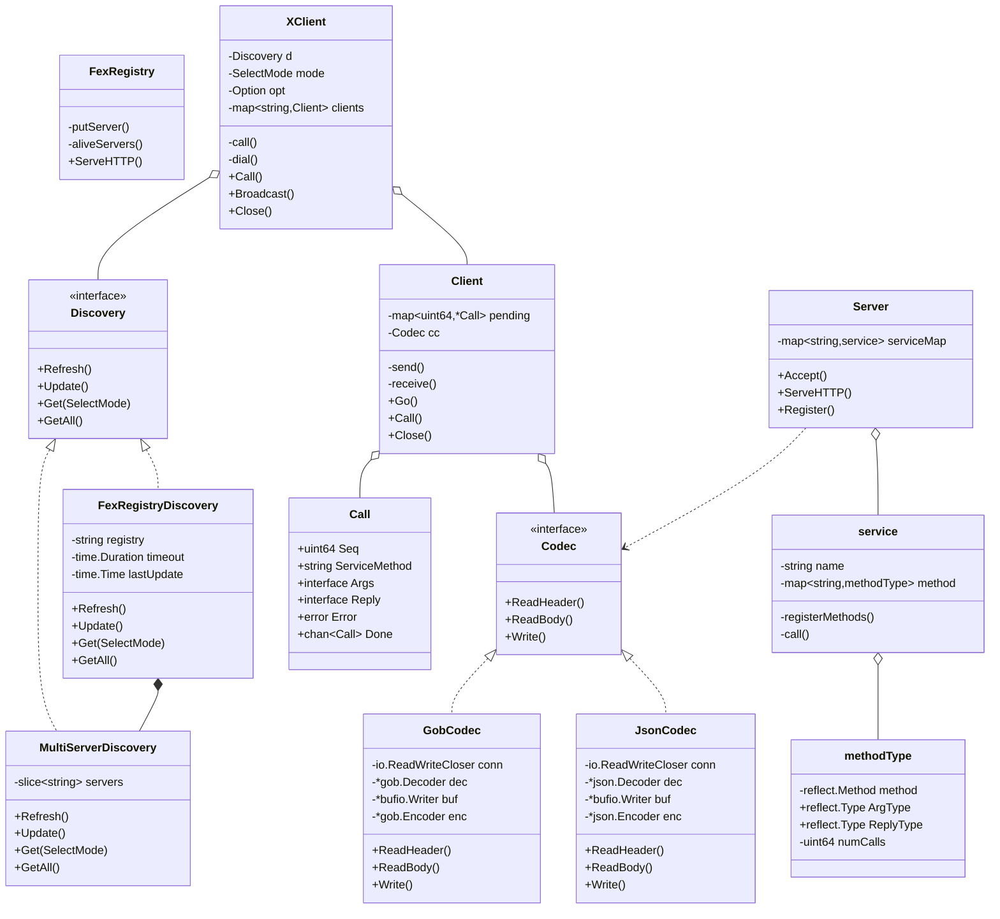

# RPC 框架 - FexRPC

> 参考 [7 days golang programs from scratch](https://github.com/geektutu/7days-golang)

## 特性

- 协议：TCP / HTTP
- 序列化：Gob / Json
- 超时控制：连接超时 / 调用超时
- 注册中心：接收服务心跳
- 负载均衡：随机选择 / Round-Robin
- 服务发现：硬编码 / 基于注册中心

## 类图


## 示例
### 编译
```shell
cd example
go build -o fexrpc
```

### 运行
```shell
cd example
go run .
```